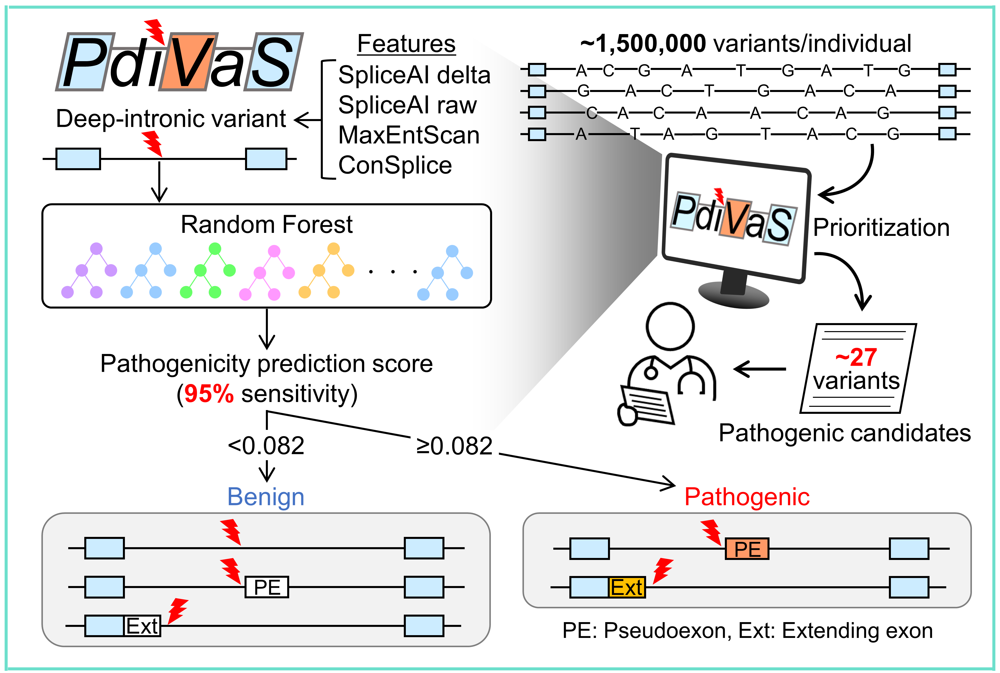
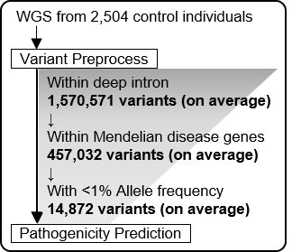

# PDIVAS : Pathogenicity Predictor for Deep-Intronic Variants causing Aberrant Splicing
[](https://opensource.org/licenses/MIT)




## Sumary
- PDIVAS is a pathogenicity predictor for deep-intronic variants causing aberrant splicing.
- The deep-intronic variants can cause pathogenic pseudoexons or extending exons which disturb the normal gene expression and can be the causal of patiens with Mendelian diseases. 
- PDIVAS efficiently prioritizes the causal candidates from a vast number of deep-intronic variants detected by whole-genome sequencing. 
- The scope of PDIVAS prediction is variants in protein-coding genes on autosomes and X chromosome. 
- This command-line interface is compatible with variant files in VCF format. 
 
PDIVAS is modeled on random forest algorism to classify pathogenic and benign variants with referring to features from  
1) **Splicing predictors** of [SpliceAI](https://github.com/Illumina/SpliceAI) ([Jaganathan et al., Cell 2019](https://www.sciencedirect.com/science/article/pii/S0092867418316295?via%3Dihub)) and [MaxEntScan](http://hollywood.mit.edu/burgelab/maxent/Xmaxentscan_scoreseq.html) ([Yao and Berge, j. Comput. Biol. 2004](https://www.liebertpub.com/doi/10.1089/1066527041410418?url_ver=Z39.88-2003&rfr_id=ori%3Arid%3Acrossref.org&rfr_dat=cr_pub++0pubmed))  
(*)The output module of SpliceAI was customed for PDIVAS features (see the Option2, for the details).
          
 2) **Human splicing constraint score** of [ConSplice](https://github.com/mikecormier/ConSplice) ([Cormier et al., BMC Bioinfomatics 2022](https://bmcbioinformatics.biomedcentral.com/articles/10.1186/s12859-022-05041-x)).

## Reference & contact
[Kurosawa et al. medRxiv 2023](https://www.medrxiv.org/content/10.1101/2023.03.20.23287464v2)  
a0160561@yahoo.co.jp (Ryo Kurosawa at Kyoto University)

## \<Option1\><br>Prediction with the PDIVAS-precomputed files (SNV+ short indels　(1~4nt))
For the quick implementation of PDIVAS, please use the score-precomputed file [here](https://console.cloud.google.com/storage/browser/pdivas;tab=objects?project=vibrant-crawler-377901&prefix=&forceOnObjectsSortingFiltering=false&hl=ja).
Possible rare SNVs and short indels (1~4nt) in genes (n=4,512) of Mendelian diseases were comprehensively annotated in the file.
To annotate your VCF file, please run the command below,for example.

**0. Installation**
```sh
conda install -c bioconda tabix bcftools
```

**1. Perform PDIVAS prediction**
```sh
# move to your working directory. (The case below is the directory in this repository.)
cd examples
bgzip -c ex.vcf > ex.vcf.gz
tabix ex.vcf.gz
#This site file below enables quick annotation
bcftools query -f'%CHROM\t%POS\n' ex.vcf.gz > ex_sites.txt
bcftools annotate -c 'INFO/PDIVAS' -a PDIVAS_snv_precomputed_GRCh38.vcf.gz -R ex_sites.txt ex.vcf.gz | bgzip -c > ex_precomp.vcf.gz
#Compare the output_precomp.vcf.gz with output_precomp_expect.vcf.gz to validate the succcessful annotation.
```

## \<Option2\><br>Perform annotation of individual features and calculation of PDIVAS scores 
For more complehensive annotation than pre-computed files, run PDIVAS by following the description below.

**0-1. Installation**
```sh
#It is better to prepare new conda environments for PDIVAS installation.
#1.Environment for calculating PDIVAS features and PDIVAS itself
conda create -n PDIVAS
conda activate PDIVAS
#It takes a little long time to solve the environment.
conda install -c bioconda -c conda-forge bcftools ensembl-vep==105 spliceai tensorflow==2.6.2 pdivas
```
The successful installation was verified on anaconda version 23.3.1

**0-2. Setting custommed usages**

-For output-customized SpliceAI
```sh
git clone https://github.com/shiro-kur/PDIVAS.git
cd PDIVAS/Customed_SpliceAI
cp ./__main__for_customed_SpliceAI.py installed_path/__main__.py
cp ./utils_for_customed-SpliceAI.py installed_path/utils.py
cp -rf ./annotations_for_customed_SpliceAI installed_path/annotations

# Examples of installed_path (~/miniconda3/envs/PDIVAS_feat/lib/python3.7/site-packages/spliceai/)
# You can check the path via $ pip show spliceai
# the successfully-customed result was described in examples/~~.vcf
```

-For VEP custom usage
- Donwload VEP cache file (version>=107, should correspond to your installed VEP version).  
Follow the instruction of "Manually downloading caches" part below.  
(https://asia.ensembl.org/info/docs/tools/vep/script/vep_cache.html)
- To implement MaxEntScan plugin, follow the instruction below.  
(https://asia.ensembl.org/info/docs/tools/vep/script/vep_plugins.html#maxentscan)
- Download ConSplice score file from [here](https://console.cloud.google.com/storage/browser/pdivas;tab=objects?project=vibrant-crawler-377901&prefix=&forceOnObjectsSortingFiltering=false&hl=ja).  
The file was editted from the originally scored file by ([Cormier et al., BMC Bioinfomatics 2022](https://home.chpc.utah.edu/~u1138933/ConSplice/best_splicing_constraint_model/)).

**1. Preprocessing VCF format (resolve the mullti-allelic site to biallelic sites)**
```sh
conda activate PDIVAS
bcftools norm -m - multi.vcf > bi.vcf
```

**2. Add gene annotations, MaxEntScan scores and ConSplice scores with VEP.**
```sh
vep \
--cache --offline --cache_version 107 --assembly GRCh38 --hgvs --pick_allele_gene \
--fasta ./references/hg38.fa.gz --vcf --force \
--custom ./references/ConSplice.50bp_region.inverse_proportion_refo_hg38.bed.gz,ConSplice,bed,overlap,0 \
--plugin MaxEntScan,./references/MaxEntScan/fordownload,SWA,NCSS \
--fields "Consequence,SYMBOL,Gene,INTRON,HGVSc,STRAND,ConSplice,MES-SWA_acceptor_diff,MES-SWA_acceptor_alt,MES-SWA_donor_diff,MES-SWA_donor_alt" \
--compress_output bgzip \
-i ./examples/ex.vcf.gz -o ./examples/ex_vep.vcf.gz
```

**3. Add output-customized SpliceAI scores**
```sh
spliceai -I examples/ex_vep.vcf.gz -O examples/ex_vep_AI.vcf -R hg38.fa -A grch38 -D 300 -M 1
```

**4. Perform the detection of deep-intronic variants and PDIVAS prediction**
```sh
pdivas predict -I examples/ex_vep_AI.vcf -O examples/ex_vep_AI_PD.vcf.gz -F off
```
**5. (Optional) Convert VCF file with PDIVAS annotation to TSV file (1 gene annotation per 1 line)**
```sh
pdivas vcf2tsv -I examples/ex_vep_AI_PD.vcf.gz -O examples/ex_vep_AI_PD.tsv
```

## Usage of PDIVAS command line
**1. $ pdivas predict**  
Required parameters:
 - ```-I```: Input VCF(.vcf/.vcf.gz) with variants of interest.
 - ```-O```: Output VCF(.vcf/.vcf.gz) with PDIVAS predictions `GENE_ID|PDIVAS_score` Variants in multiple genes have separate predictions for each gene.
 
Optional parameters:
 - ```-F```: filtering function (off/on) : Output all variants (-F off; default) or only deep-intronic variants with PDIVAS scores (-F on)")
 
 Details of PDIVAS INFO field:

|    ID    | Description |
| -------- | ----------- |
|  GENE_ID  | Ensembl gene ID based on GENCODE V41(GRCh38) or V19(GRCh37) |
|  PDIVAS  | \<Predicted result\> <br> **Pattern 1 : 0.000-1.000 float value**  (The higher, the more deleterious) <br> \<Exceptions\> <br> - Output with '-F off'. Filtered with '-F on'. <br> **Pattern 2 : 'wo_annots'**, variants out of VEP or SpliceAI annotations : <br>**Pattern 3 : 'out_of_scope'**, variants without PDIVAS annotation scope<br>       (chrY, non-coding gene or non-deep-intronic variants)　<br>**Pattern 4 :'no_gene_match'**, variants without matched gene annotation between VEP and SpliceAI|

**2. $ pdivas vcf2tsv**  
Required parameters:
 - ```-I```: *Input VCF(.vcf/.vcf.gz) with VEP, SpliceAI,and PDIVAS annotations.
 - ```-O```: The path to output tsv file name and pass.  
 *Input VCF is valid only when it was generated through this pipeline.

## Interpretation of PDIVAS scores
More details in .
| Threshold | Sensitivity (*1) | candidates/individual (*2) |
| ------- | --- | --- |
| >=0.082 | 95% | 26.8 |
| >=0.151 | 90% | 14.5 |
| >=0.340 | 85% | 6.7 |
| >=0.501 | 80% | 4.1 |
| >=0.575 | 75% | 3.0	|
| >=0.763 | 70% | 1.2 |

(*1) Sensitivites were calculated on curated pathogenic deep-intronic variants in a test dataset.  
(*2) Candidates of pathogenic deep-intronic variants were obtained through the process described below. (WGS: Whole-genome sequencing)


